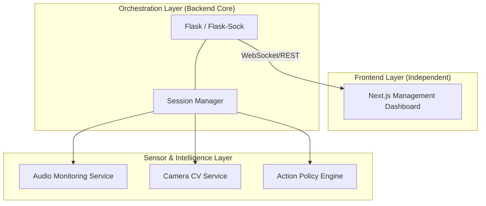

# Attentia.ai: Real-time Adaptive Learning Engine

`attentia.ai` is a specialized backend orchestration engine designed for real-time study assistance. The system handles high-frequency sensor data, manages biometric calibration, and coordinates an adaptive intervention policy to support learners in real-time.

---

## 🏗 System Architecture

The engine is built on a modular, event-driven architecture that bridges low-level hardware sensing with a high-level management platform.



## 🚀 Backend Engineering Highlights

- **Real-time Orchestration:** Handles concurrent data streams from microphone (RMS/Spectral features) and camera (MediaPipe CV) via a unified background session loop.
- **WebSocket Protocol Design:** Implemented a custom JSON-based protocol for zero-latency state synchronization between the Python engine and the browser.
- **Dynamic Calibration:** Built a "Baseline-First" state machine that calibrates sensor inputs to a specific user's environment before enabling active interventions.
- **Modular Service Design:** Decoupled hardware-specific logic (OpenCV, SoundDevice) from application state, allowing for graceful failover when devices are unavailable.

## 📁 Project Structure

```text
attentia_ai/
├── src/attentia_ai/       # Core Backend Engine
│   ├── server.py          # API & WebSocket Entrypoint
│   ├── session.py         # Session Orchestration & Logic
│   ├── audio_service.py   # Signal Processing (Audio)
│   ├── camera_service.py  # CV Pipelines (MediaPipe/OpenCV)
│   └── rl_policy.py       # Policy Selection Logic
├── web/                   # Next.js Management Platform
├── docs/                  # System Documentation
└── scripts/               # Utility & Bootstrap Scripts
```

## 🐳 Docker Support

The platform is fully containerized for development and deployment. This demonstrates proficiency in multi-stage Docker builds and service orchestration.

### Prerequisites
- Docker & Docker Compose

### Quick Start
To build and run both the backend engine and the management platform:

```bash
docker-compose up --build
```

- **Backend:** `http://localhost:8000`
- **Frontend Dashboard:** `http://localhost:3000`

> [!IMPORTANT]
> **Hardware Passthrough Note:**
> While the code is container-ready, accessing the host machine's Camera and Microphone from within a Docker container on macOS is a known technical constraint (due to the Linux VM layer). 
> - **In Production/Cloud:** Data would typically be streamed from the browser client frontend to the backend engine via WebSockets (already implemented in `web/`).
> - **In Local Dev:** Direct hardware access via OpenCV/SoundDevice is best performed by running the backend natively (`python scripts/run_server.py`).

## 🛠 Installation (Native)

### macOS / Linux
```bash
python3 -m venv .venv
source .venv/bin/activate
pip install -r requirements.txt
export PYTHONPATH=src
python scripts/run_server.py
```

### Windows Command Prompt
```bat
python -m venv .venv
.venv\Scripts\activate
pip install -r requirements.txt
set PYTHONPATH=src
python scripts/run_server.py
```

---

## Documentation Map

- `docs/architecture.md`
  system architecture, runtime modules, and integration boundaries
- `docs/api.md`
  backend routes and payload contracts
- `docs/guide.md`
  product and RL state/action model
- `docs/operations.md`
  setup, environment, permissions, troubleshooting, and demo checklist
