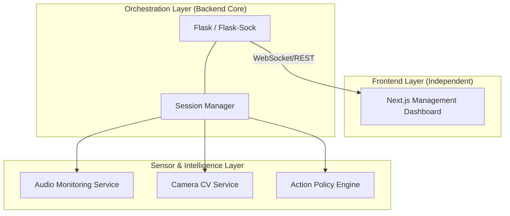

# Attentia.ai: Real-time Adaptive Learning Engine

`attentia.ai` is a specialized backend orchestration engine designed for real-time study assistance. The system handles high-frequency sensor data, manages biometric calibration, and coordinates an adaptive intervention policy to support learners in real-time.

---

## 🏗 System Architecture

The engine is built on a modular, event-driven architecture that bridges low-level hardware sensing with a high-level management platform.



## 🚀 Backend Engineering Highlights

- **Real-time Orchestration:** Handles concurrent data streams from microphone (RMS/Spectral features) and camera (MediaPipe CV) via a unified background session loop.
- **WebSocket Protocol Design:** Implemented a custom JSON-based protocol for zero-latency state synchronization between the Python engine and the browser.
- **Dynamic Calibration:** Built a "Baseline-First" state machine that calibrates sensor inputs to a specific user's environment before enabling active interventions.
- **Modular Service Design:** Decoupled hardware-specific logic (OpenCV, SoundDevice) from application state, allowing for graceful failover when devices are unavailable.

## 📁 Project Structure

```text
attentia_ai/
├── src/attentia_ai/       # Core Backend Engine
│   ├── server.py          # API & WebSocket Entrypoint
│   ├── session.py         # Session Orchestration & Logic
│   ├── audio_service.py   # Signal Processing (Audio)
│   ├── camera_service.py  # CV Pipelines (MediaPipe/OpenCV)
│   └── rl_policy.py       # Policy Selection Logic
├── web/                   # Next.js Management Platform
├── docs/                  # System Documentation
└── scripts/               # Utility & Bootstrap Scripts
```

### Frontend

- `frontend/index.html`
  is a minimal operator-facing demo UI that starts and stops sessions, updates learner profile fields, and renders the live backend payload

### Legacy / Prototype Files

- `scripts/BaselineClass.py`
  original standalone baseline comparison logic
- `scripts/cameraAccessClass.py`
  original standalone camera access implementation
- `src/attentia_ai/audio_monitor.py`
  earlier standalone audio-monitor prototype

These files are useful reference material but are not the main runtime entrypoint for the integrated demo.

## Installation

### macOS / Linux

```bash
python3 -m venv .venv
source .venv/bin/activate
pip install -r requirements.txt
export PYTHONPATH=src
python scripts/run_server.py
```

### Windows Command Prompt

```bat
python -m venv .venv
.venv\Scripts\activate
pip install -r requirements.txt
set PYTHONPATH=src
python scripts/run_server.py
```

Then open:

```text
http://127.0.0.1:8000
```

## Demo Workflow

1. Start the server.
2. Open the frontend.
3. Review the preflight banner to confirm Q-table, microphone, and camera readiness.
4. Set `difficulty` and `gain_capability` if needed.
5. Click `Start Session`.
6. Let the backend calibrate and begin the periodic loop.
7. Watch the frontend update with:
   - current emotion
   - distraction level
   - noise level
   - selected RL action
   - raw API payload

## Permissions and Platform Notes

- On macOS, camera access must be granted to the terminal or Python process running the backend.
- Microphone permissions may also need to be granted on first use.
- OpenCV and MediaPipe behavior may vary slightly by OS and Python version.
- The frontend itself does not access the camera or microphone directly in this branch; the backend does.

## Current Constraints

- the RL model is a static Q-table, not an online-learning agent
- the camera emotion mapping is heuristic and intended for demo use
- fallback states are used when hardware is unavailable
- the frontend is intentionally minimal and operator-oriented

## Documentation Map

- `docs/architecture.md`
  system architecture, runtime modules, and integration boundaries
- `docs/api.md`
  backend routes and payload contracts
- `docs/guide.md`
  product and RL state/action model
- `docs/operations.md`
  setup, environment, permissions, troubleshooting, and demo checklist

## Intended Next Steps

- integrate the final frontend experience
- refine camera-state classification with validated model logic
- make distraction encoding more rigorous and explainable
- add persistent session logging
- add automated tests around state encoding and action selection
- formalize deployment and packaging strategy
